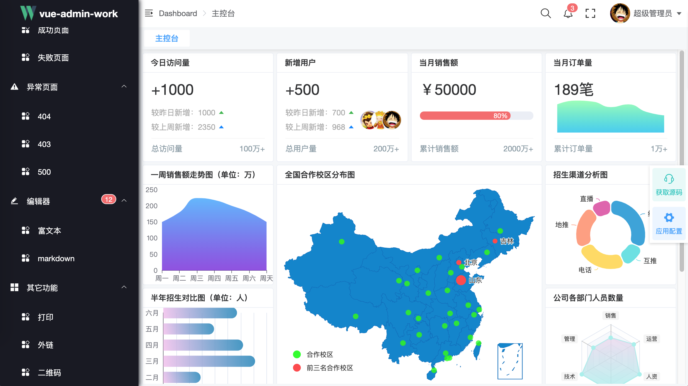
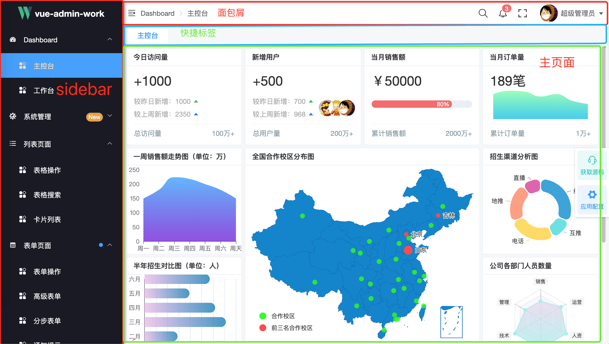
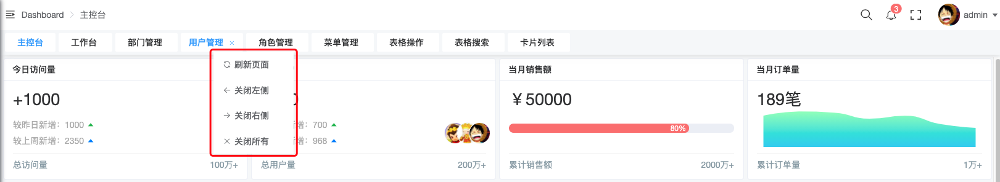
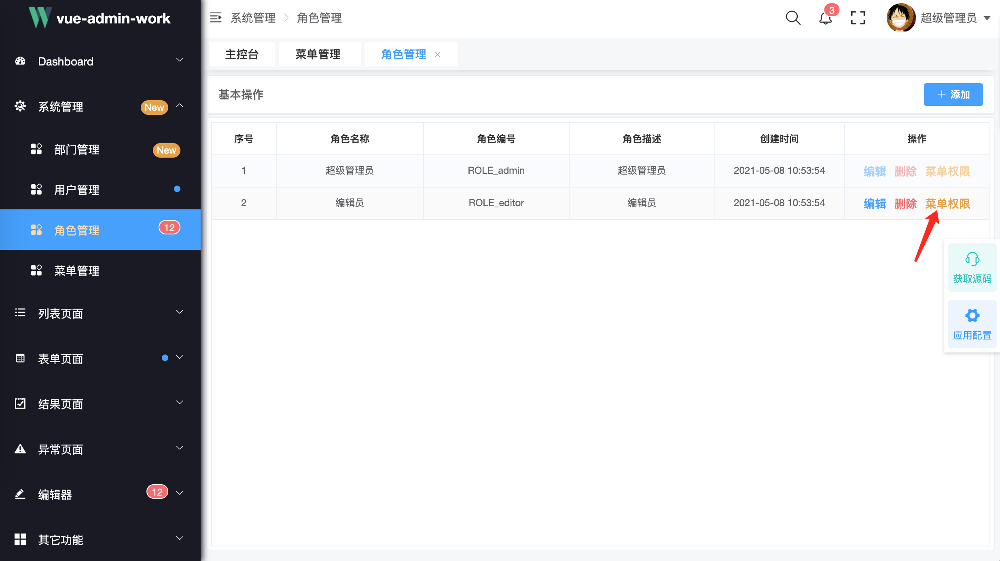
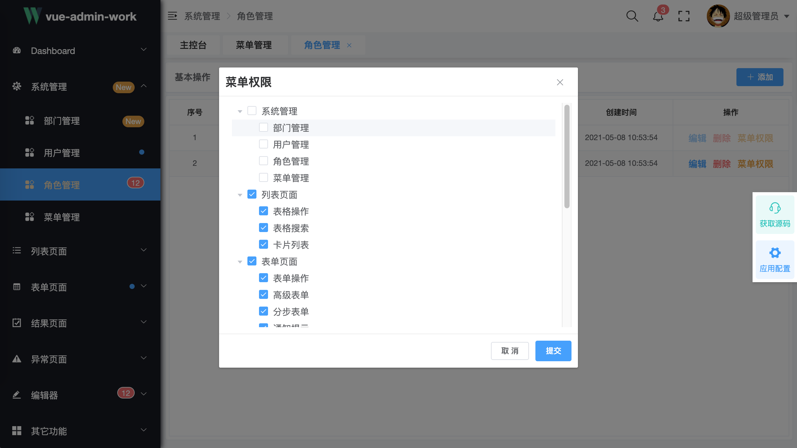
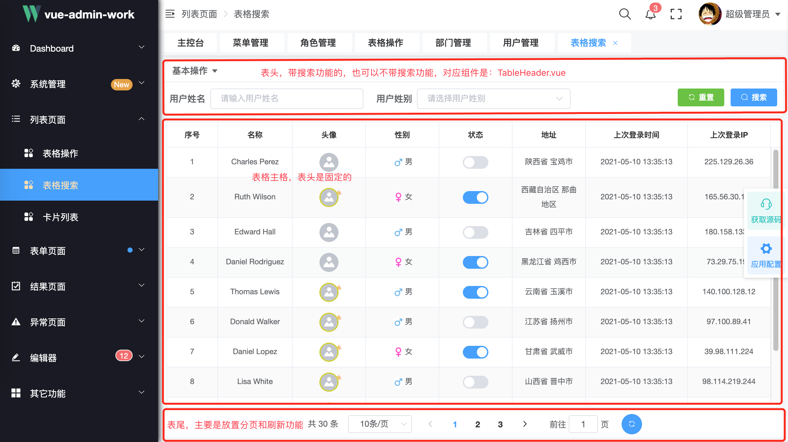

<div align="center"></div>
<h1 align="center">vue-admin-work说明文档</h1>
<h6 align="right">版本：v0.1.0-rc</h6>

### 介绍

**[vue-admin-work](http://qingqingxuan.gitee.io/vue-admin-work/)**是一款后台前端框架，是基于 [vue](https://github.com/vuejs/vue) 和 [element-ui](https://github.com/ElemeFE/element)实现。它使用了最新的前端技术栈，内置了动态路由，权限验证，把后台常用的一些操作进行了封装，只需要简单的配置就可以实现常用的功能，同时也提供了丰富的功能组件，最大程度上满足你在后台前端开发中遇到的业务场景。同时这也是一款适合有一定基础的同学想要提高自己的前端水平的学习框架。如果你之前是从事一些简单的切图（PS）只写一些静态页面（html+css），这也是一款非常适合你进入编程化前端的框架，实现高薪的梦想。无论是你想用来做什么这款框架都能帮到你。

#### 功能

```json
- 登录、注销
- Dashboard
	- 主页
	- 工作台
- 系统管理
  - 部门管理
  - 用户管理
	- 角色管理
	- 菜单管理
- 列表页面
	- 表格操作
	- 表格搜索
	- 卡片列表
- 表单页面
	- 表单操作
	- 高级表单
	- 分步表单
	- 通知提示
- 结果页面
	- 成功页面
	- 失败页面
- 异常页面
	- 404
	- 403
	- 500
- 编辑器
	- 富文本
	- markdown
- 其它功能
	- 打印
	- 外链
	- 二维码
	- 未完待续……

- 全局功能
  - 多种动态换肤
  - 动态侧边栏（支持多级路由嵌套）
  - 动态面包屑
  - 快捷导航(标签页)
  - Svg Sprite 图标
  - 本地/后端 mock 数据
  - Screenfull全屏
	- 消息提醒
  - 自适应收缩侧边栏
	- 系统配置
```

#### 项目目录

```shell
├── README.md
├── babel.config.js
├── jest.config.js
├── jsconfig.json
├── mock
│   ├── base.js
│   ├── index.js
│   ├── list
│   ├── router
│   └── user
├── package-lock.json
├── package.json
├── public
│   ├── favicon.ico
│   ├── index.html
│   └── static
├── src
│   ├── App.vue
│   ├── main.js
│   ├── api
│   ├── assets
│   ├── components
│   ├── directive
│   ├── icons
│   ├── layout
│   ├── mixins
│   ├── model
│   ├── router
│   ├── store
│   ├── styles
│   ├── utils
│   └── views
└── vue.config.js

```

#### 获取源码

> **重要提示**：
>
> **无论通过哪种方式都得需要你提前在自己的电脑上安装好[node](http://nodejs.cn/)环境，如不清楚安装过程，请上网查阅相关资料。这里假定你已经在电脑上安装好[node](http://nodejs.cn/)环境**

- 通过 git，需要你提前在自己的电脑上安装好 git 环境。如不清楚安装过程，请上网查阅相关资料。

  **这里假定你已经在电脑上安装好 git 环境**

  ```shell
  // 通过git克隆代码
  git clone *****
  // 进入项目目录
  cd vue-admin-work
  // 安装依赖
  npm install
  // 运行项目
  npm run serve

  ```

- 通过压缩文件，直接把文件解压出来，然后

  ```shell
  // 进入项目目录
  cd vue-admin-work
  // 安装依赖
  npm install
  // 运行项目
  npm run serve
  ```

启动完成后会自动打开浏览器访问 [http://localhost:5566](http://localhost:9527/)， 代表运行成功。



#### 开发工具

本项目开发工具是：[**vscode**](https://code.visualstudio.com/) 。也是作者推荐的开发工具，结合一些丰富的插件让你在开发过程中体验更加美好

> 推荐几款常用的开发**vue**的插件
>
> - [vetur](https://github.com/vuejs/vetur) 开发 vue 项目必备插件
> - **Auto Close Tag** 自动闭合 HTML/XML 标签
> - **Auto Rename Tag** 自动完成另一侧标签的同步修改
> - **Path Intellisense** 自动路径补全
> - **HTML CSS Support** 让 html 标签上写 class 智能提示当前项目所支持的样式

以上插件是作者常用的几款，并不代表必须只需要这些，在实际开发中根据个人情况来定。

#### 反馈

如果你在使用过程中有任何的问题或者有好的建议都可以给作者反应，作者会根据实际需求进行增加或者改进。

联系方式如下：

> **QQ 客服：353087890**
>
> **QQ 群：89165685**
>
> **微信公众号：知码前端**

|  | 微信公众号 “知码前端” |  |
| :---------------------------------------------------------------------------- | :-----------------------------------------------------------------------------------------------: | ----------------------------------------------------------------------------- |


### 布局-流程

#### Layout 布局



页面的整体布局包括：侧边栏、导航栏、快捷标签、主页面四个部分组成。基中侧边栏最上面是一个企业 logo 容器，可以根据实际情况更新 logo 和 标题。

对应的源码是：**src/layout/index.vue**。

> 注：此 layout 以后有可能会单独抽出成为一个独立的项目，以方便添加更多的布局样式。

#### SPA 工作流程

SPA 的是全称是：**Single Page Application** 中文意思是：单页面应用

结合[**Vue Router**](https://router.vuejs.org/)看一下匹配过程：

- 首先是 **App.vue**

  ```vue
  <template>
    <div id="app">
      <router-view />
    </div>
  </template>

  <script>
  export default {
    name: "App"
  };
  </script>
  ```

  App.vue 中的 **<router-view />**匹配到的组件是**Layout**，这里的**Layout**就是 **src/layout/index.vue**

- 其次是 **Layout**(src/layout/index.vue)，部分源码如下：

  ```vue
  <template>
    <div>
      <div>
        <SideBar />
      </div>
      <div>
        <div class="header-layout-wrapper">
          <NavBar />
          <TagView />
        </div>
        <section>
          // 重点看一下
          <AppMain />
        </section>
      </div>
      <Setting />
    </div>
  </template>
  ```

  在**Layout**组件中包含了一下**AppMain**组件

- 最后是**AppMain**，部分源码如下：

  ```vue
  <template>
    <transition>
      <keep-alive>
        <router-view />
      </keep-alive>
    </transition>
  </template>
  ```

  可以看到**AppMain**中又包含了一个 <router-view/>组件，这样在**AppMain**又可以继续匹配路由了

- 举例说明一下：

  在浏览器地址栏里输入以下链接是如何显示出页面的，这里忽略登录状态，假定用户已经登录，输入此链接会直接显出当前页面

  http://localhost:5566/#/index/main

  看一下部分路由表配置：

  ```js
  {
      path: '/index',
      name: 'index',
      component: Layout,
      hidden: false,
      meta: {
        title: 'Dashboard',
        icon: 'dashboard'
      },
      children: [
        {
          path: 'main',
          name: 'Main',
          component: () => import('@/views/index'),
          meta: {
            title: '主控台',
            affix: true,
            cacheable: true
          }
        }
      ]
    },
  ```

  当匹配到了 **'/index'** 路径是的时候，会加载对应的**Layout**组件，Layout 组件中有一个 AppMain 组件，里面又包含了一个 <router-view />，同时可以看到路由表配置还有一个 **children**属性，完全匹配到**'/index/main'**路径的时候，path 为'main'所对应的 component 组件被加载。

  大体就是这么一个匹配过程，具体的可以看 **[Vue Router](https://router.vuejs.org)**官网中[**嵌套路由文档**](https://router.vuejs.org/zh/guide/essentials/nested-routes.html)

### 路由

路由和侧边栏是一个后台管理项目的重点，也是一个比较难理解的地方

#### 知识准备

- **Vue Router 知识**
- **element-ui 中的 ElMenu 组件和 ElScrollbar 组件**
- **router-link 和 router-view 组件**

#### 说明

本项目路由生成的思路如下：

1. 用户登录成功之后获取**token**和**role**
2. 通过后台接口查询该用户所对应角色的菜单列表
3. 前端处理获取到的菜单列表，按一定的规则动态生成路由表
4. 通过**vue-router**实例的**.addRoutes()**方法动态添加路由

#### 原始路由信息

以**editor**角色为例，从后台获取的原始路由信息如下：

```js
[
  {
    // 菜单地址
    menuUrl: "/list",
    // 菜单名称
    menuName: "列表页面",
    // 菜单图图标
    icon: "list",
    // 所包含的子菜单
    children: [
      {
        menuUrl: "/list/table",
        menuName: "表格操作"
      },
      {
        menuUrl: "/list/table-with-search",
        menuName: "表格搜索"
      },
      {
        menuUrl: "/list/grid-list",
        menuName: "卡片列表"
      }
    ]
  },
  {
    menuUrl: "/form",
    menuName: "表单页面",
    // 菜单提示信息
    tip: "circle",
    icon: "form",
    children: [
      {
        menuUrl: "/form/base-form-view",
        menuName: "表单操作",
        cacheable: true
      },
      {
        menuUrl: "/form/advance-form",
        menuName: "高级表单",
        cacheable: true
      },
      {
        menuUrl: "/form/step-form",
        menuName: "分步表单"
      },
      {
        menuUrl: "/form/tip",
        menuName: "通知提示"
      }
    ]
  },
  {
    menuUrl: "/editor",
    menuName: "编辑器",
    tip: "12",
    icon: "editor",
    children: [
      {
        menuUrl: "/editor/rich-text",
        menuName: "富文本"
      },
      {
        menuUrl: "/editor/markdown",
        menuName: "markdown"
      }
    ]
  },
  {
    menuUrl: "/other",
    menuName: "其它功能",
    children: [
      {
        menuUrl: "/other/print",
        menuName: "打印"
      },
      {
        menuUrl: "http://www.baidu.com",
        menuName: "外链"
      },
      {
        menuUrl: "/other/qrcode",
        menuName: "二维码"
      }
    ]
  }
];
```

#### 前端路由信息配置项

从后台获取到的原始路由信息经过如下函数处理，最终生成我们所需要的路由信息：

```js
function generatorRoutes(res) {
  const tempRoutes = [];
  res.forEach(it => {
    const route = {
      //url 信息
      path: it.menuUrl,
      // 设定路由的名字，建议一定要设置此name，因为有可能根据此配置跳转页面，在缓存页面的时候本项目也是采用此配置来保存的
      name: getNameByUrl(it.menuUrl),
      // 当设置 true 的时候该路由不会在侧边栏出现，如login 404 等页面
      hidden: !!it.hidden,
      // 对应的vue组件
      component: isMenu(it.menuUrl) ? Layout : getComponent(it.menuUrl),
      meta: {
        // 路由标签名字，主要用在 快捷标签 栏和导航栏中
        title: it.menuName,
        // 设置为true，标识着在 快捷标签 中不会有关闭按钮
        affix: !!it.affix,
        // 设置为true，标识着可以被<router-view/>组件缓存
        cacheable: !!it.cacheable,
        // 路由的图标信息
        icon: it.icon || "",
        // 路由的提示信息，目前有三种提示方式：new、小圆点、数字，对应的 tip：new、circle、12（具体的数字）
        tip: it.tip
      }
    };
    if (it.children) {
      // 子路由
      route.children = generatorRoutes(it.children);
    }
    tempRoutes.push(route);
  });
  return tempRoutes;
}
```

> TIP
>
> <router-view />通过 include 缓存的时候是根据组件的 name 字段来缓存，所以最好是给每一个组件都设置一下 name 属性，而且要和 route 配置项中的 name 保持一致，因为在保存 name 的时候是根据 route.name 配置项来保存的

#### 最终路由表

经过上两步动态生成的路由表还不够，有一些页面是不需要动态生成的，也就是说是**不需要权限**的，如：**login 页面** 、**404、500**等页面，当然本项目为了演示把**主页和工作页**也做成了固定页面，在实际项目根据需要自行添加删除。

在 **src/router/index.js**文件中所有的固定路由如下：

```js
export const routes = [
  {
    path: "/redirect",
    component: Layout,
    hidden: true,
    children: [
      {
        path: "/redirect/:path(.*)",
        component: () => import("@/views/redirect/index")
      }
    ]
  },
  {
    path: "/login",
    name: "login",
    component: () => import("@/views/login"),
    hidden: true
  },
  {
    path: "/personal",
    name: "personal",
    component: Layout,
    hidden: true,
    children: [
      {
        path: "index",
        name: "personalCenter",
        component: () => import("@/views/personal"),
        meta: {
          title: "个人中心"
        }
      }
    ]
  },
  {
    path: "/",
    name: "root",
    redirect: "/index/main",
    hidden: true
  },
  {
    path: "/index",
    name: "index",
    component: Layout,
    hidden: false,
    meta: {
      title: "Dashboard",
      icon: "dashboard"
    },
    children: [
      {
        path: "main",
        name: "Main",
        component: () => import("@/views/index"),
        meta: {
          title: "主控台",
          affix: true,
          cacheable: true
        }
      },
      {
        path: "workplace",
        name: "WorkPlace",
        component: () => import("@/views/index/work-place"),
        meta: {
          title: "工作台",
          cacheable: true
        }
      }
    ]
  },
  {
    path: "/404",
    component: () => import("@/views/exception/404"),
    hidden: true
  },
  {
    path: "*",
    redirect: "/404",
    hidden: true
  }
];
```

再把动态生成的路由信息通过 **.addRoutes()**方法添加到路由实例中就形成了本项目中所需要的所有路由信息表

```js
router.beforeEach((to, from, next) => {
  NProgress.start();
  if (to.name === "login") {
    next();
    NProgress.done();
  } else {
    if (!isTokenExpired()) {
      next(`/login?redirect=${to.path}`);
      NProgress.done();
    } else {
      const isEmptyRoute = store.getters["user/isEmptyRoutes"];
      if (isEmptyRoute) {
        // 加载路由
        const accessRoutes = [];
        getRoutes().then(async routes => {
          accessRoutes.push(...routes);
          await store.dispatch("user/saveRoutes", accessRoutes);
          router.addRoutes(accessRoutes);
          next({ ...to, replace: true });
        });
      } else {
        next();
      }
    }
  }
});
```

### 侧边栏

#### 知识准备

- **[element-ui](https://element.eleme.cn/) 框架中的 ElMenu 组件**
- **[Vuex](https://vuex.vuejs.org/)**

#### 数据来源

通过上面的分析说明，当不同用户登录成功之后，会通过**role**来动态加载菜单，从而生成路由表。然后我们把生成的路由表信息存储到 **vuex** 中

#### 嵌套路由

本框架**通过递归的方式**支持多级路由的形式，不过为了用户的体验最好是不要超过三级路由，两级路由就已经满足了大部分的需求。如果在实际开发中真的需要三级路由，请不忘记在二级的页面中加入<router-view/>，如：

```vue
<template>
  <router-view />
</template>
```

#### 外链

通过配置路由项中的 **path** 属性来实现外链功能，本框架通过判断 **path** 属性值是否以 **https://** 或者 **http://** 开头，如果是以两种情况下开头，则会认为是外链，在点击菜单的时候就会打开一个新的页面打开链接

```js
{
  "path": "external-link",
  "component": Layout,
  "children": [
    {
      "path": "http://qingqingxuan.gitee.io/vue-admin-work/",
    }
  ]
}
```

#### 默认展开菜单

本框架并没有加入此功能，如果想要实现此功能，也很简单，只需要配置 **el-menu** 组件的 **default-openeds** 属性就好。具体参考 **[element-ui 中的 NavMenu 导航菜单](https://element.eleme.cn/#/zh-CN/component/menu)**

### 面包屑

#### 知识准备

- **Element-ui 中 Breadcrumb 组件**
- **Vue 中的 watch 用法**

#### 实现思路

通过 vue 组件中的 watch 监听 \$route 变化来动态生成。部分源码如下：

```js
data() {
  return {
    breadcrumbs: []
  }
},
watch: {
  $route() {
    this.generateBreadcrumb()
  }
},
methods: {
  generateBreadcrumb() {
    this.breadcrumbs = xxxxx
  },
}
```

### 快捷标签

#### 知识准备

- **element-ui 中 Tabs 组件**
- **Vuex**

效果如下图：




此页面比较简单，但是所需要的技术含量还是比较多的。如下：

- **需要定制 tabs 的样式**
- **需要理解 Vuex 几个特性**
- **需要点右键弹出上下文菜单**
- **可以刷新当前页面**
- **刷新页面的时候，访问过的页面信息可以保留，也就是可以持久化**

#### 实现思路

通过监听 \$route 动态变化 把当前的路由信息保存，然后通过 tabs 展示形式显示出已经保存的页面信息

#### 右键弹出上下文菜单

如要在**PC**端弹出上下文菜单，可以通过**@contextmenu.native.prevent=""**事件来实现，代码如下：

```vue
<el-tabs
  id="tagViewTab"
  v-model="currentTab"
  type="card"
  class="padding-left-sm padding-right-sm"
  @tab-click="clickRoute"
  @tab-remove="removeRoute"
  @contextmenu.native.prevent="onContextMenu(currentTab, $event)"
>
  <el-tab-pane
   v-for="item of visitedRoutes"
   :key="item.path"
   :label="item.meta.title"
   :name="item.path"
   :closable="!isAffix(item)"
   />
</el-tabs>
```

> TIP
>
> @contextmenu.native.prevent 是写在 el-tabs 组件上面的，而不是写在 el-tab-pane 组件上面，如果写在子组件上不会有效果

```js
onContextMenu(item, ctx) {
      const { clientX, clientY } = ctx
      const { x } = this.$el.getBoundingClientRect()
      const parentElementRect = document.getElementById('tagViewTab')
        .getElementsByClassName('el-tabs__nav is-top')[0].getBoundingClientRect()
      if (clientX < parentElementRect.x) {
        return
      }
      if (clientX > parentElementRect.x + parentElementRect.width) {
        return
      }
      this.selectRoute = null
      this.selectRoute = this.visitedRoutes.find(it => {
        const { x, width } = document.getElementById('tab-' + it.path).getBoundingClientRect()
        if (x < clientX && clientX < (x + width)) {
          return it
        }
      })
      if (this.selectRoute) {
        this.showLeftMenu = this.isLeftLast(this.selectRoute)
        this.showRightMenu = this.isRightLast(this.selectRoute)
        const screenWidth = document.body.clientWidth
        this.contextMenuStyle.left = ((clientX + 130) > screenWidth ? clientX - 130 - x - 15 : clientX - x + 15) + 'px'
        this.contextMenuStyle.top = clientY + 'px'
        this.showContextMenu = true
      }
    },
```

#### 刷新当前页面

本框架采用的刷新方式是通过 **redirect** 的页面，当做中间页面，当刷新页面的时候，就加载 **redirect** 页面，

当加载完成 **redirect** 页面的时候，在 **created** 生命周期函数中再**replace** 跳转回来。

实现方法还有好多种，可以按自己的喜好实现就好，如果不想自己实现用本框架的也可以

#### 持久化路由信息

用过 vuex 的人都知道，vuex 中保存的信息是放在内存中的，当刷新浏览器的时候，内存的数据也会清空，就导致 vuex 保存的信息会丢失。体现到页面中就是已经访问过的页面，在刷新一下浏览器的时候，页面信息会丢失。

所以本框架采用的把 vuex 中的数据持久化到 **localStorage** 中，在合适的时机再把数据从 **localStorage** 中恢复出来，这样就可以实现已经访问过的页面在刷新浏览器的时候不会丢失。

```js
PERSISTENT_VISITED_ROUTES(state, rootState) {
const tempPersistendRoutes = state.visitedRoute.map(it => {
      return {
        fullPath: it.fullPath,
        meta: it.meta,
        name: it.name,
        params: it.params,
        path: it.path,
        query: it.query
      }
    })
    localStorage.setItem(rootState.user.userName + '_visited', JSON.stringify(tempPersistendRoutes))
  },
```

#### 固定页面

有些页面是不可以删除的，如本框架中：工作台页面。这就需要在 路由配置项中的 **meta** 中配置一个属性: **affix** 设置为 **true** 就可以了

### 新增页面

在讲解这方面的知识之前，需要先明确几个概念以及它们之间的关系：

+ 浏览器地址栏路径，如 `http://xxxxx.com/#/page/index `中的 `/page/index`和路由配置项中的 `path`属性

+ 项目中文件夹及文件的命名

+ 路由配置项中的 `name` 属性

+ 页面组件中 `name`属性

  如果我们要添加一个页面，需要在侧边档中显示，则需要先在`菜单管理`页面中添加对应的页面信息。再提交到后台中，再分配给不同的`角色`。最后在项目的`views`文件夹下面创建对应的目录和文件 

  如果我们要添加的页面，不需要在侧边栏中显示，则需要先在项目的 `router`文件夹下面的 `index.js`中的 `routes`添加路由信息。最后在项目的`views`文件夹下面创建对应的目录和文件

  不管在侧边栏显示与否，都得需要在 `views`文件夹下创建对应的目录和文件。

  上面几个概念的关系：

  > + 如在`菜单管理`中动态添加的页面的`地址`为 `/system/role-info`，则需要项目的 `views`文件夹下面创建 `system`目录，并且创建一个名为 `role-info`的**vue**组件，如：`role-info.vue`。切记，**菜单的地址**要和文件夹和文件的命名保持一致，否则，就会找不到相应的组件。
  >
  > + 如在项目中的 `router/index.js`中的 `routes`属性添加的路由信息，如下：
  >
  >   ```js
  >   {
  >       path: '/next-page',
  >       name: 'nextPage',
  >       component: Layout,
  >       hidden: true,
  >       children: [
  >         {
  >           path: 'info',
  >           name: 'nextPageInfo',
  >           component: () => import('@/views/next-page/details.vue'),
  >           meta: {
  >             title: '下一页详情'
  >           }
  >         }
  >       ]
  >     }
  >   ```
  >
  >   要访问 `nextPageInfo`页面的地址是：`/next-page/info`。因为我们是手动指定的 `component`，所以页面地址可以和文件夹及文件的名字不一样，但是为了统一管理和项目的可读性，**还是建议要把`页面地址`和`文件夹及文件`的名字一致。**
  >
  > + 路由配置项中的`name`属性和组件中的`name`属性，我们建议两者要保持一致。通过 `菜单管理`动态添加 的页面，在动态生成路由`name`属性的时候是用的最后一个地址，如：`/next-page/page-info`，框架已经自动把`page-info`转成了`PageInfo`,`name`属性就是`PageInfo`而组件中的`name`属性要写成`PageInfo`。所以两者也是一致的。
  >
  >   通过手动在项目添加的路由也要遵守这个规则，要保持一致

#### 需要在侧边栏显示

1. 在 **菜单管理** 中添加一个菜单
2. 在项目中**views**目录添加对应的 **.vue** 组件，如果添加的是一个二级页面，则只需要找到一级页面的目录，新增一个 **.vue** 文件；如果是添加的是一个一级页面，则需要在 **views** 目录下创建对应的目录，然后再在该目录 里面创建对应的 **.vue** 文件
3. 再给某个**角色**分配这个页面





#### 不需要在侧边栏显示

有些页面不需要在侧边栏显示，如 **文章详情** 页面，可以按以下步骤添加一个新页面

1. 在 **src/router/index.js**中的 **routes** 常量中添加一个路由配置，如添加**个人中心**页面

   ```js
   {
       path: '/personal',
       name: 'personal',
       component: Layout,
       // 一定要把 hidden 属性设置成 true，否则就会在侧边栏中显示出来了
       hidden: true,
       children: [
         {
           path: 'index',
           name: 'personalCenter',
           component: () => import('@/views/personal'),
           meta: {
             title: '个人中心'
           }
         }
       ]
     }
   ```

> TIP
>
> 1. 在不在侧边栏显示是根据 路由配置项 是的 hidden 属性来控制的
> 2. 本框架中所有的数据都是通过 mock 中来的，并没有一个真正的后台环境，所以很多情况都是模拟的，只是演示出效果。

### 其它

#### 网络请求

网络请求一直都是前后端分享项目的重中之重，真实环境下一个后台管理系统不可能离开后台接口而独自运行，否则没有实际意义。

前端对接后台接口的几个步骤：

1. 前端 UI 组件产生交互操作；
2. 发起网络请求，可以是 **ajax** 也可以是 **fetch**；
3. 获取服务端返回的数据，并处理数据；
4. 更新页面显示；

本框架采用的的请求框架是 **[axios](http://www.axios-js.com/)**，是一款非常优秀的网张请求框架，也是对原生的**XHR**的封装，支持很多特性，如：**promise**

为了更好，更方便的使用，本框架对网络请求这块做了大量的工作，对于一般的 **CRUD** 操作都做了封装，只需要简单的配置就可以，下面看一下项目的网张整体架构图：


分析一下这张图：

- 最底层是**axios**的配置文件，里面封装了 **basURL、interceptors.request、interceptors.response** 等一些信息，我们所有的网络请求最终都会调用 **axios** 的方法

- 再往上一层是框架自己封装的 **http** 常用操作，包含了 **get** 和 **post** 两种请求方法，并且放在了 Vue 函数的原型链上，方便了组件的灵活调用

- 再上一层是业务逻辑方法的封装，包括 **查询、模糊查询、增加、删除、修改、更新**等操作，是以**Vue**框架中的**Mixins**的形式存在，方便注入调用

- 最上面的是平时用的组件页面，如：最常用表格页面，表单页面，这些**Vue**组件可以按需引入不同的**Mixin**，如一个表格页面只用到了查询功能，那在配置**Vue**的时候只要混入**GetDataMixin**就好，如下：

  ```js
  import { GetDataMixin } from "@/mixins/ActionMixin";
  export default {
    mixins: [GetDataMixin]
  };
  ```

#### 请求具体流程

在实际开发过程中，我们需要和后台开发人员一起配合对接接口。

1. 配置 **axios** 的 **baseURL**

2. 在 **src/api/url.js** 文件中添加请求路径，如下：

   ```js
   export const getArticleList = "/article/getList";
   ```

   一定要通过 export 把接口名显露出去，否则在别的文件中不能获取到

3. 在 **ArticleList.vue** 文件中添加加载数据功能，如下：

   ```js
   import { GetDataMixin } from "@/mixins/ActionMixin";
   export default {
     name: "ArticleList",
     mixins: [GetDataMixin],
     data() {
       return {
         articleList: []
       };
     },
     mounted() {
       // 初始化加载请求功能
       this.initGetData({
         // 通过 $urlPath 获取 之前已经配置好了的 getArticleList 路径
         url: this.$urlPath.getArticleList,
         params: () => this.withPageInfoData(),
         beforeAction: () => {
           this.tableLoading = true;
         },
         afterAction: () => {
           this.tableLoading = false;
         },
         onResult: res => {
           this.articleList = res.list;
         }
       }).then(() => {
         this.getData();
       });
     }
   };
   ```

#### MockJs

因为本框架是一个纯前端的项目，并没有真正的对接后台接口，所以使用 [mockjs](https://github.com/nuysoft/Mock)来模拟数据。其原理如下：

**拦截了所有的请求并代理到本地，然后进行数据模拟**

##### 添加新的数据

1. 在项目的 **mock** 文件夹下面添加想要模拟的**js**文件，如：**article.js**， 里面添加要请求的地址如:

   ```js
   Mock.mock(RegExp(getArticleList), function({ body }) {
     const { page, pageSize = 10 } = JSON.parse(body);
     const size = computePageSize(totalSize, page, pageSize);
     return Mock.mock({
       ...baseData,
       totalSize,
       [`data|${size}`]: [
         {
           id: function() {
             return Random.string(10);
           },
           image: Random.image("300x600", "#50B347", "#FFF", "vue-admin-work"),
           description: function() {
             return Random.csentence(50, 200);
           },
           "price|1000-9999.2": 100
         }
       ]
     });
   });
   ```

2. 在 **mock** 文件下面引入刚才添加的 **article.js**文件：

   ```js
   import "./article.js";
   ```

   这样就可以了

##### 移除 Mock 数据

如果后台人员开完了某个接口，需要对接正式的接口了，只需要把对就的 **mock** 下对应的接口删除了即可

如果后台人员把所有的接口都开发完了，不需要本地模拟了，只需要在 **main.js** 中把对应的 **mock** 有关依赖删除了就好，如：

```js
import Vue from "vue";
import App from "./App.vue";
import router from "./router";
import store from "./store";
import "./icons";
import "./utils";
import "@/styles/index.scss";
import "./api/http";

// 不需要 mock 只需要把下面代码注释了即可
// import '../mock'
import "@/assets/theme/blue/index.css";

Vue.config.productionTip = false;

new Vue({
  router,
  store,
  render: h => h(App)
}).$mount("#app");
```

#### 跨域问题

##### 产生原因

跨域问题真的是在前端开发中最常见，问的最多的问题，很多人根本不明白倒底什么是跨域。其实跨域是浏览器的一种行为，是为了保护网站的一种方式，首先肯定的一点是出于安全的角度才设计出来的这样一种同源策略。同源策略会阻止一个域的 javascript 脚本和另外一个域的内容进行交互。所谓同源（即指在同一个域）就是两个页面具有相同的协议（protocol），主机（host）和端口号（port）

产生的原因也很简单，只要当一个请求 url 的**协议、域名、端口**三者之间任意一个与当前页面 url 不同即为跨域

| **当前页面 url**         | **被请求页面 url**              | **是否跨域** | **原因**   |
| ------------------------ | ------------------------------- | ------------ | ---------- |
| http://www.xxx.com/      | http://www.xxxx.com/index.html  | 否           | 同源       |
| http://www.xxx.com/      | https://www.xxxx.com/index.html | 是           | 协议不同   |
| http://www.xxx.com/      | http://www.yyy.com/             | 是           | 主机不同   |
| http://www.xxx.com/      | http://test.xxx.com/            | 是           | 子域名不同 |
| http://www.xxx.com:8080/ | http://www.xxx.com:80/          | 是           | 端口不同   |

##### 解决办法

###### cors

**cors** ：全称 Cross Origin Resource Sharing（跨域资源共享），前端基本不需要做什么配置，和原来的写法基本一样，主要是后台人员得配置一些东西。更多的内容请参考 **[阮一峰的《跨域资源共享 CORS 详解》](https://www.ruanyifeng.com/blog/2016/04/cors.html)**介绍的非常清楚

###### 代理

这种方式只需要前端人员配置就好，如：webpack 中 proxy，但是这种方式只能在开发阶段使用，正式环境下不可以使用，其实本质就是在本地开启了一个代理服务器，所有的请求都转发到这个代理服务器，保持同源，从而不会产生跨域的问题。另外也可以在正式的环境下通过配置 **nginx** 来实现代理服务器的功能。两种方式的原理基本相同

个人更推荐 **cors**这种方式，无论是开发阶段还是正式环境下都可以使用，最重要的是我们前端不需要做任何东西就可以使用。

#### 常用功能

本框架中封装了很多的常用的操作，以及业务逻辑和常用的组件，正是因为有了这些小的功能单元才组成了这样复杂的逻辑

##### 表格

一个后台管理系统大部分的功能，可以说 80%的逻辑功能是由<font color=#ff0000>**表格和表单**</font>支撑起来的，所以本框架也对<font color=#ff0000>**表格和表单**</font>做了大量的封装。当然，如果你不喜欢作者封装的这些功能，也可以自己的方式书写，总之，能把功能实现出来就好

###### **网络（CRUD）Mixin**

- **GetDataMixin**

  普通的加载接口数据，在使用时首页要通过 `import` 引入，如:

  ```js
  import { GetDataMixin } from "@/mixins/ActionMixin";
  ```

  然后可以在 `mounted`生命周期函数中初始化，如:

  ```js
  mounted() {
      this.initGetData({
        url: this.$urlPath.getTableList,
        params: () => this.withPageInfoData(),
        beforeAction: () => {
          this.tableLoading = true
        },
        afterAction: () => {
          this.tableLoading = false
        },
        onResult: (res) => {
          this.handleSuccess(res)
        }
      }).then(() => {
        this.getData()
      })
   }
  ```

  `this.initGetData()`方法在返回一个 `Promise`对象，这样做的目地是方便，在初始化配置之后可以加载接口数据。

  下面分析一下 `initGetData`方法的参数信息：

  ```js
  function initGetData({ url, method, params, beforeAction, onResult, onError, afterAction }) : Promise
  ```

  该方法接收一个对象类型的参数，该对象可以配置的属性有：

  - url：必填，否则会抛出异常，`throw new Error('please init url')`，该参数对应的是要加载的接口信息

  - method：请求方法，一般是 `GET` 或者是 `POST`

  - params：请求参数，该参数可以是一个对象类型，也可以是一个函数类型，这取决于要传递的参数是不是动态的。如：参数就是固定值，`{articleId: 1}`，多次请求都是一样的值，则可以写成对象类型；相反，如果每次请求的参数是动态变化的，如：分页信息，就可以写成函数类型并且一定要返回一个对象类型的数据。如下：

    ```js
    params: () => {
      return {
        pageNum: this.pageNum
      };
    };
    ```

    如果不需要传递任何参数，则不用写此属性

  - beforeAction：函数类型，在真正发起请求之前要做的一些操作，如打开加载状态等前置操作

  - onResult：函数类型，只有请求状态码返回 200 的情况下才会被调用，用于处理返回来的数据

  - onError：函数类型，当请求状态码返回不是 200 的情况下会被调用，用于处理错误状态

  - afterAction：函数类型，在真正发起请求之后要做的一些操作，如关闭加载状态等后置操作，但不要在这里处理请求到的数据，因为有专门处理数据的方法：onResult。这个函数无论是请求成功还是失败都会被调用

- AddItemMixin

  用于添加一条数据，同样，在使用的时候需要先`import` 引入，如：

  ```js
  import { AddItemMixin } from "@/mixins/ActionMixin";
  ```

  > TIP
  >
  > 对于 **增加、删除、更新、模糊查询** 这些操作，都是需要用户点击某个按钮才能触发的操作，不像 **查询** 那样，可以一进入页面在适当的生命周期如，**created、mounted** 生命周期方法直接调用。所以，这类操作提供了两个函数，以 **AddItemMixin**为例，有：**onAddItem**，**doAddItem** 两个函数，
  >
  > **onAddItem** 函数可以响应按钮操作，**doAddItem** 是直接执行操作的函数

  看一下 `AddItemMixin`的源码：

  ```js
  export const AddItemMixin = {
    methods: {
      initAddItem({
        url,
        method,
        params,
        onAddItem,
        beforeAction,
        onResult,
        onError,
        afterAction
      }) {
        if (!url) {
          throw new Error("please init url");
        }
        this.addItemModel.url = url;
        this.addItemModel.method = method;
        this.addItemModel.params = params;
        this.addItemModel.onResult = onResult;
        this.addItemModel.onError = onError;
        this.addItemModel.beforeAction = beforeAction;
        this.addItemModel.afterAction = afterAction;
        this.addItemModel.onAddItem = onAddItem;
        this.addItemModel.init = true;
      },
      onAddItem() {
        if (!this.addItemModel.onAddItem) {
          throw new Error("please init onAddItem");
        }
        if (!(this.addItemModel.onAddItem instanceof Function)) {
          throw new Error("onAddItem must be Function");
        }
        this.addItemModel.onAddItem();
      },
      doAddItem() {
        if (!this.addItemModel.init) {
          throw new Error("please init addItemModel first");
        }
        const data = checkParams(this.addItemModel);
        if (!data) {
          throw new Error("please set add param");
        }
        addItem
          .call(this, {
            url: this.addItemModel.url,
            method: this.addItemModel.method || "post",
            data
          })
          .then(res => {
            handleResult.call(this, this.addItemModel, res);
          })
          .catch(error => {
            handleError.call(this, this.addItemModel, error);
          });
      }
    }
  };
  ```

  值得说一下 `initAddItem`方法参数中的 `onAddItem`属性，可以看做是 点击 某个按钮时的响应函数。

  其它的参数都与 `GetDateMixin` 中的 `initGetData`函数参数一样。

- **UpdateItemMixin**

  用于更新一条记录，同样，在使用的时候需要先`import` 引入，如：

  ```js
  import { UpdateItemMixin } from "@/mixins/ActionMixin";
  ```

  用法与 `AddItemMixin` 一样，`initUpdateItem`方法参数也与 `AddItemMixin` 的 `initAddItem` 方法参数一样

- **DeleteItemsMixin**
  用于删除一条或者多条记录，同样，在使用的时候需要先`import` 引入，如：

  ```js
  import { UpdateItemMixin } from "@/mixins/ActionMixin";
  ```

  与其它操作不同的是：删除操作可以针对一条记录，也可以针对多条记录，即：批量删除。因此在初始化的时候就分成了两种情况。先看下与其它不一样的初始化参数：

  - url：必填，否则会抛出异常，`throw new Error('please init url')`，该参数对应的是要加载的接口信息
  - method：请求方法，一般是 `GET` 或者是 `POST`
  - params：请求参数，该参数可以是一个对象类型，也可以是一个函数类型，如果是函数类型则需要返回一个对象类型的数据，<font color=#ff0000> **这个属性用于删除单条记录** </font>
  - multiParams：请求参数，该参数可以是一个对象类型，也可以是一个函数类型，如果是函数类型则需要返回一个对象类型的数据，<font color=#ff0000> **这个属性用于删除多条记录** </font>
  - onDeleteItem：**当单击删除按钮时的回调函数**，接收一个参数，就是要删除的记录对象
  - onDeleteMultiItem：**当单击 批量删除 按钮时的回调函数**
  - beforeAction：函数类型，在真正发起请求之前要做的一些操作，如打开加载状态等前置操作
  - onResult：函数类型，只有请求状态码返回 200 的情况下才会被调用，用于处理返回来的数据
  - onError：函数类型，当请求状态码返回不是 200 的情况下会被调用，用于处理错误状态
  - afterAction：函数类型，在真正发起请求之后要做的一些操作，如关闭加载状态等后置操作，但不要在这里处理请求到的数据，因为有专门处理数据的方法：onResult。这个函数无论是请求成功还是失败都会被调用

  > TIP
  >
  > 本框架是一个纯属前端的项目，并没有真正对接后台接口，所有的数据和行为都是通过 MockJs 模拟或者本地模拟，所以在实际开发环境下一定要对接真正的后台接口

真实场景开发步骤如下：

1. 引入 `import { DeleteItemsMixin } from '@/mixins/ActionMixin'`

2. 配置组件的 `mixins`选项，如下：

   ```js
   export default {
     name: "UserList",
     mixins: [DeleteItemsMixin]
   };
   ```

3. 在 `mounted`生命周期函数中初始化操作，如下：

   ```js
   export default {
     name: 'UserList',
     mixins: [ DeleteItemsMixin ],
     mounted() {
       this.initDelteItem({
         url: xxxxx,
         // 当删除一条记录的时候调用，以方便生成接口所需要的参数
         params: () => {
           // 返回的参数要结合后台所提供的接口情况而定，这里只是演示
           return {
             ids: this.tempItem.id
           }
         },
         // 当批量删除多条记录的时候调用，以方便生成接口所需要的参数
         multiParams: () => {
           // 返回的参数要结合后台所提供的接口情况而定，这里只是演示
           return {
             ids: this.selectedItems.map(it=> it.id).join(',)
           }
         },
        // 当要删除某一条记录的时候，执行此方法
        onDeleteItem: (item) => {
           this.tempItem = item
           this.$showConfirmDialog('确定要删除此信息吗？').then((_) => {
             // 调用真正执行删除的操作，'single'参数是方便区分是删除单条记录还是删除多条记录
             this.doDeleteItem('sinlge')
           })
         },
         // 当要批量删除多条记录的时候，执行此方法
         onDeleteMultiItem: () => {
           this.$showConfirmDialog('确定要删除这些信息吗？').then((_) => {
             // 调用真正执行删除的操作，'multi'参数是方便区分是删除单条记录还是删除多条记录
             this.doDeleteItem('multi')
           })
         },
         // 操作执行成功之后的回调方法
         onResult: () => { },
         // 操作执行失败之后的回调方法
         onError: () => { }
       })
     }
   }
   ```

4. 在`<template><div></div></template>`视图中给`删除按钮`添加监听事件，如下：

   ```vue
   <template>
     <div class="main-container">
       <TableHeader :can-collapsed="false">
         <template slot="right">
           // 删除多条记录
           <el-button
             type="danger"
             size="mini"
             icon="el-icon-delete"
             @click="onDeleteMultiItem"
             >批量删除
           </el-button>
         </template>
       </TableHeader>
       <TableBody ref="tableBody">
         <template>
           <el-table
             ref="table"
             v-loading="tableLoading"
             :data="dataList"
             :header-cell-style="tableConfig.headerCellStyle"
             :size="tableConfig.size"
             :stripe="tableConfig.stripe"
             :border="tableConfig.border"
             :height="tableConfig.height"
             row-key="id"
             :tree-props="{ children: 'children' }"
           >
             <el-table-column
               align="center"
               label="序号"
               fixed="left"
               width="80"
             >
               <template slot-scope="scope">
                 {{ scope.$index + 1 }}
               </template>
             </el-table-column>
             <el-table-column align="center" label="部门名称" prop="name" />
             <el-table-column align="center" label="部门编号" prop="depCode" />
             ......
             <el-table-column align="center" label="操作">
               <template slot-scope="scope">
                 <el-link
                   type="primary"
                   :underline="false"
                   @click="onUpdateItem(scope.row)"
                   >编辑</el-link
                 >
   
                 // 删除单条记录
                 <el-link
                   type="danger"
                   :underline="false"
                   @click="onDeleteItem(scope.row)"
                   >删除</el-link
                 >
               </template>
             </el-table-column>
           </el-table>
         </template>
       </TableBody>
     </div>
   </template>
   ```

- **LikeSearchMixin**

  这个功能是单单为 **表格类型的页面** 模糊搜索而制定的，局限性比较大，而且还得配合其它的功能才能实现。所以在项目中如果不需要，可以不引入。详细文档放到后面和其它功能一起讲解

- **PageModelMixin**

  该功能主要是为了表格的分页功能，先看一下源码：

  ```js
  export const PageModelMixin = {
    data() {
      return {
        // 分页模型
        pageModel: {
          // 当前页数，从1开始
          currentPage: 1,
          // 每页的条数，默认是10条
          pageSize: 10,
          // 总页数
          totalSize: 0
        }
      };
    },
    methods: {
      // 当 每页的条数 改变的时候，回调的方法
      pageSizeChanged(pageSize) {
        this.pageModel.pageSize = pageSize;
        this.pageModel.currentPage = 1;
        this.publishEvent("pageChanged", this.pageModel);
      },
      // 当 当前页数 改变的时候，回调的方法
      currentChanged(currentPage) {
        this.pageModel.currentPage = currentPage;
        this.publishEvent("pageChanged", this.pageModel);
      },
      // 用于把分页信息和其它参数一起封装成一个对象，传给后台接口
      withPageInfoData(otherParams = {}) {
        return {
          ...otherParams,
          page: this.pageModel.currentPage,
          pageSize: this.pageModel.pageSize
        };
      }
    },
    created() {
      this.registeEvent(pageEvents);
    }
  };
  ```

###### 组件

先来看一下本框架设计的表格页面的组成部分：



- **TableHeader.vue**

  表头主要放置的信息是标题，常用操作按钮，如添加，删除，可以根据自己的业务逻辑添加相关的按钮。

  一个重要的功能就是：**模糊搜索**，有些表格页面是带有模糊搜索功能的，有的没有此功能。如果想要在添加**搜索**功能，则需要设置几个属性：

  - **canCollapsed**：此属性默认值是 **false**，请设置成 **true**
  - **searchModel**：搜索模型，（后面会具体讲到详细用法）**一定要设置成一个非空的数组**
  - **defaultCollapsedState**：默认展开状态，**true** 为展开，默认是 **true**，可以不用设置，除非想设置成默认是关闭状态

  说这里，就详细说一下上面一个没有细说的 Mixin-----`LikeSearchMixin`，这个模型就是专门为此功能而开发，讲解一下源码：

  ```js
  export const LikeSearchMixin = {
    data() {
      return {
        // 搜索模型
        likeSearchModel: {
          init: false,
          // 搜索的表单项集合
          conditionItems: []
        }
      };
    },
    methods: {
      // 初始化搜索功能，重点讲一下几个参数的
      initLikeSearch({
        url,
        method,
        conditionItems,
        extraParams,
        beforeAction,
        onResult,
        onError,
        afterAction
      }) {
        if (!url) {
          throw new Error("please init url");
        }
        if (!onResult) {
          throw new Error("please init onSearchResult function");
        }
        if (!(onResult instanceof Function)) {
          throw new Error("onSearchResult must be Function type");
        }
        this.likeSearchModel.url = url;
        this.likeSearchModel.method = method;
        this.likeSearchModel.conditionItems = conditionItems;
        this.likeSearchModel.extraParams = extraParams;
        this.likeSearchModel.onResult = onResult;
        this.likeSearchModel.onError = onError;
        this.likeSearchModel.beforeAction = beforeAction;
        this.likeSearchModel.afterAction = afterAction;
        this.likeSearchModel.init = true;
      },
      // 执行搜索的方法
      doSearch() {
        if (!this.likeSearchModel.init) {
          throw new Error("please init likeSearchModel first");
        }
        let searchParams = this.generatorSearchParams();
        if (isOjbect(this.likeSearchModel.extraParams)) {
          searchParams = {
            ...searchParams,
            ...this.likeSearchModel.extraParams
          };
        } else if (isFunction(this.likeSearchModel.extraParams)) {
          searchParams = {
            ...searchParams,
            ...this.likeSearchModel.extraParams()
          };
        }
        likeSearch
          .call(this, {
            url: this.likeSearchModel.url,
            method: this.likeSearchModel.method || "post",
            data: searchParams
          })
          .then(res => {
            handleResult.call(this, this.likeSearchModel, res);
          })
          .catch(error => {
            handleError.call(this, this.likeSearchModel, error);
          });
      },
      // 重置搜索表单项
      resetSearch() {
        this.likeSearchModel.conditionItems &&
          this.likeSearchModel.conditionItems.forEach(it => {
            it.value = "";
          });
      },
      // 判断表单项是否有值
      hasSearchParams() {
        return this.likeSearchModel.conditionItems.some(it => it.value !== "");
      },
      // 把表单项转成普通对象
      generatorSearchParams() {
        if (
          this.likeSearchModel.conditionItems &&
          this.likeSearchModel.conditionItems.length !== 0
        ) {
          return this.likeSearchModel.conditionItems.reduce((pre, cur) => {
            pre[cur.name] = cur.value;
            return pre;
          }, {});
        }
        return {};
      }
    }
  };
  ```

  重点看一下`initLikeSearch`方法中的几个函数：

  - **conditionItems：**表单项数组，这个参数的用处就是最后在执行搜索的时候，收集表单项中的值，然后生成，提交到后台接口的参数。后面会详细讲解表单项的生成过程和一些属性
  - **extraParams：**额外的参数，**可以是一个对象类型，也可以是函数类型**，**函数类型要返回一个对象类型的值**。这个参数的意义是，当表单项数组中的数据不满足后台接口需要的参数的时候，就通过这个参数的值和表单项的值组合在一起，最终生成后台接口所需要的参数。**最常见的例子就是：额外的添加分页信息。**如果表单项中的数据完全满足后台接口所需要的参数，那么这个参数可以不指定。

  **表单项：**

  目前框架支持的表单类型有：`input`、`select`、`date-range`、`date`、`datetime`、`time`。以后可能会添加更多的表单类型。看一个表单项的配置：

  ```js
  conditionItems: [
    {
      name: 'name', // 必填，当前表单项的名称，和后台接口的参数名对应
      label: '用户姓名',// 必填，当前表单项的标题
      value: '', // 必填，当前表单项的值
      type: 'input', // 必填，当前表单项的类型
      placeholder: '请输入用户姓名', // 选填，input 类型的默认提示语
      span: 8 // 选填，当前表单项在一行中所占权重，默认就是 8
    },
    {
      name: 'sex',
      label: '用户姓别',
      value: '',
      type: 'select', // 必填，当前表单项的类型
      placeholder: '请选择用户姓别',
      selectOptions: [ // 必填，当前表单项的类型是 `select`的时候，选项的数据
        {
          label: '男', // 选项标题
          value: 0 // 选项值
        },
        {
          label: '女',
          value: 1
        }
      ],
      span: 8
    }
  ]

  **事件：**

  **TableHeader**中有两个事件：**doSearch，resetSearch**，分别对应着，**搜索和重置**两个按钮的点击事件

  ```

- **TableBody.vue**

  具体的表格内容，很简单，源码如下:

  ```vue
  <template>
    <el-card
      :body-style="{ padding: 0 }"
      class="table-container"
      :style="cardStyle"
      shadow="never"
    >
      <slot name="table"></slot>
    </el-card>
  </template>
  
  <script>
  import TableBodyMixin from "@/mixins/TableBodyMixin";
  export default {
    name: "TableBody",
    mixins: [TableBodyMixin]
  };
  </script>
  ```

  在页面中使用 `TableBody`的时候，因为要动态计算表格的高度，所以必须要设置两个地方的 `ref`，如下：

  ```vue
  <template>
    <div class="main-container">
      <TableHeader>
      </TableHeader>
      <!-- 这里设置 ref="tableBody" 且只能设置成这个名称 -->
      <TableBody ref="tableBody">
        <template>
          <!-- 这里设置 ref="table" 且只能设置成这个名称 -->
          <el-table
            ref="table"
            :data="dataList"
            :height="tableConfig.height"
          >
            <el-table-column
              type="selection"
              width="45"
            />
            <el-table-column
              align="center"
              label="序号"
              width="80"
            >
              <template slot-scope="scope">
                {{ scope.$index + 1 }}
              </template>
            </el-table-column>
            <el-table-column
              align="center"
              label="名称"
              prop="nickName"
            />
            <el-table-column
              align="center"
              label="性别"
              prop="gender"
            >
              <template slot-scope="scope">
                <span>{{ scope.row.gender === 0 ? '男' : '女' }}</span>
              </template>
            </el-table-column>
            <el-table-column
              align="center"
              label="地址"
              prop="address"
            />
            <el-table-column
              align="center"
              label="上次登录时间"
              prop="lastLoginTime"
              width="160px"
            />
            <el-table-column
              align="center"
              label="上次登录IP"
              prop="lastLoginIp"
              width="130px"
            />
          </el-table>
        </template>
      </TableBody>
    </div>
  </template>
  ```

  <font color=#ff0000>如果没有设置两处的 `ref` 可能会导致页面显示不正常，如果页面显示不正常看看这两个地方是否设置了 `ref`属性，且名称是否正确！！！！</font>

  详情可以看具体的源码。

- **TableFooter.vue**

  表尾主要的功能是：分页和刷新。分页没什么好讲的，和 `element-ui`加的 `el-pagination`用法一致。如不清楚， 可以看一下 **element-ui** 文档。

  这里需要注意一个地方就是：**刷新**

  因为表格页面有两个加载数据的地方：普通加载 和 模糊搜索。当点击刷新按钮的时候容易出现混乱，所以框架规定了 模糊搜索 优先，即，当表头的搜索表单项有值的时候，就优先执行 模糊搜索，如果没有就执行 普通的加载 方法。框架也提供了一个 `mixin`来应对这种场景：

  ```js
  export const RefreshActionMixin = {
    methods: {
      doRefresh() {
        if (this.isInited("likeSearchModel")) {
          if (this.hasSearchParams()) {
            // 搜索有值，优先执行模糊搜索的方法
            this.doSearch();
          } else {
            // 执行普通的列表查询
            this.getData();
          }
        } else if (this.isInited("getDataModel")) {
          // 执行普通的列表查询
          this.getData();
        } else {
          // 如果都没有设置就报错
          throw new Error("can`t exec doRefresh function");
        }
      }
    }
  };
  ```

  当引入 `PageModelMixin`的时候， 就自动引入了 `RefreshActionMixin`

##### 表单

###### 封装的用法

关于表单的功能，本框架提供了提供了一个`BaseForm.vue`简单组件，和 **模糊搜索** 的表单项功能差不多，也是由表单项生成相应的表单组件。看一下源码：

```vue
<template>
  <div class="base-form-container">
    <el-form
      ref="form"
      :label-position="config.labelPosition || 'right'"
      :label-width="(config.labelWidth || 80) + 'px'"
      :size="config.size || 'small'"
    >
      <el-form-item
        v-for="(item, i) of innerFormItems"
        :key="i"
        :label="item.label"
      >
        <el-col :span="24">
          <el-input
            v-if="item.type === 'input'"
            v-model="item.value"
            :placeholder="item.placeholder || '请输入内容'"
            :size="config.size || 'small'"
            clearable
            :type="item.inputType || ''"
            :maxlength="item.maxLength"
            :rows="item.rows || 5"
            class="form-item"
          />
          <el-select
            v-else-if="item.type === 'select'"
            v-model="item.value"
            :placeholder="item.placeholder || '请选择条目'"
            :size="config.size || 'small'"
            :filterable="item.filterable ? true : false"
            clearable
            style="width: 100%"
            class="form-item"
            @change="
              item.onChange
                ? item.onChange(item.value, item.associatedOption || '')
                : () => {}
            "
          >
            <el-option
              v-for="optionItem in item.selectOptions"
              :key="optionItem.value"
              :value="optionItem.value"
              :label="optionItem.label"
            />
          </el-select>
          <el-date-picker
            v-else-if="item.type === 'date-range'"
            v-model="item.value"
            type="daterange"
            range-separator="-"
            start-placeholder="开始日期"
            end-placeholder="结束日期"
            class="form-item"
            style="width: 100%"
            :size="config.size || 'small'"
          />
          <el-date-picker
            v-else-if="item.type === 'date'"
            v-model="item.value"
            type="date"
            range-separator="-"
            :placeholder="item.placeholder || '请选择日期'"
            class="form-item"
            :size="config.size || 'small'"
          />
          <el-date-picker
            v-else-if="item.type === 'datetime'"
            v-model="item.value"
            type="datetime"
            :placeholder="item.placeholder || '请选择日期'"
            class="form-item"
            :size="config.size || 'small'"
          />
          <el-time-picker
            v-else-if="item.type === 'time'"
            v-model="item.value"
            arrow-control
            :picker-options="{
              selectableRange: '00:00:00 - 23:59:59'
            }"
            :placeholder="item.placeholder || '请选择时间'"
            class="form-item"
            :size="config.size || 'small'"
          />
          <el-radio-group
            v-if="item.type === 'radio-group'"
            v-model="item.value"
            :size="config.size || 'small'"
          >
            <component
              :is="item.style === 'button' ? 'el-radio-button' : 'el-radio'"
              v-for="optionItem of item.radioOptions"
              :key="optionItem.value"
              :label="optionItem.value"
              >{{ optionItem.label }}</component
            >
          </el-radio-group>
          <el-checkbox-group
            v-if="item.type === 'check-group'"
            v-model="item.value"
            :size="config.size || 'small'"
          >
            <component
              :is="
                item.style === 'button' ? 'el-checkbox-button' : 'el-checkbox'
              "
              v-for="optionItem of item.checkOptions"
              :key="optionItem.value"
              :label="optionItem.value"
              >{{ optionItem.label }}</component
            >
          </el-checkbox-group>
        </el-col>
      </el-form-item>
      <slot name="extra"></slot>
    </el-form>
  </div>
</template>

<script>
import FormMixin from "@/mixins/FormMixin";
export default {
  name: "BaseForm",
  mixins: [FormMixin],
  props: {
    config: {
      type: Object,
      default: function() {
        return {
          size: "small",
          labelWidth: "80",
          labelPosition: "right"
        };
      }
    },
    formItems: {
      type: Array,
      default: function() {
        return [];
      }
    }
  },
  watch: {
    formItems: {
      handler() {
        this.refreshItems();
      },
      deep: true
    }
  },
  mounted() {
    this.refreshItems();
  }
};
</script>
```

同样的，该组件也提供了几种表单类型：

- input
- select
- date-range
- date
- datetime
- time
- radio-group
- check-group

另外，该组件还支持 `slot`功能，以防止在以上类型不够用的时候，可以自己定义不同的类型，如上传图片功能

看一下表单项的属性：

```js
data() {
    return {
      formItems: [
        {
          label: '会议名称：',
          type: 'input',
          name: 'name',
          value: '',
          maxLength: 50,
          inputType: 'text',
          placeholder: '请输入会议名称',
          // 表单校验规
          validator: ({ value, placeholder }) => {
            if (!value) {
              this.$errorMsg(placeholder)
              return false
            }
            return true
          }
        },
        {
          label: '会议内容：',
          type: 'input',
          name: 'content',
          value: '',
          maxLength: 10,
          inputType: 'text',
          placeholder: '请输入会议内容',
          // 表单校验规
          validator: ({ value, placeholder }) => {
            if (!value) {
              this.$errorMsg(placeholder)
              return false
            }
            return true
          }
        },
        {
          label: '起止时间：',
          type: 'date-range',
          name: 'startEndTime',
          placeholder: '请选择会议起止时间',
          value: '',
          validator: ({ value, placeholder }) => {
            if (!value) {
              this.$errorMsg(placeholder)
              return false
            }
            return true
          }
        },
        {
          label: '起止地点：',
          type: 'select',
          name: 'address',
          value: '',
          placeholder: '请选择会议地点',
          selectOptions: [
            {
              label: '会议一室',
              value: 1
            },
            {
              label: '会议二室',
              value: 2
            },
            {
              label: '会议三室',
              value: 3
            },
            {
              label: '会议四室',
              value: 4
            }
          ],
          validator: ({ value, placeholder }) => {
            if (!value) {
              this.$errorMsg(placeholder)
              return false
            }
            return true
          }
        }
      ]
    }
  }
```

> TIP
>
> 重要提醒：如果表单数据依赖外部的数据或者说表单有默认的值，如在编辑某一个条数据的时候，需要把原始的数据回显出来。当遇到这种场景，要把表单项写在 `computed`中，这样可以保证数据刷新。如下：
>
> ```js
> computed: {
>  formItems() {
>    return formBuilder()
>      .formItem({
>        label: '用户名称',
>        type: 'input',
>        name: 'nickName',
>        value: this.userModel.nickName,
>        maxLength: 50,
>        inputType: 'text',
>        placeholder: '请输入用户名称',
>      	// 关联属性
>        associatedOption: 'address',
>        validator: ({ value, placeholder }, { value: assValue }) => {
>          if (!value) {
>            this.$errorMsg(placeholder)
>            return false
>          }
>          if (!assValue) {
>            this.$errorMsg('地址不行')
>            return false
>          }
>          return true
>        }
>      })
>      .formItem({
>        label: '用户性别',
>        type: 'radio-group',
>        name: 'gender',
>        style: 'button',
>        value: this.userModel.gender,
>        radioOptions: [
>          {
>            label: '男',
>            value: 0
>          },
>          {
>            label: '女',
>            value: 1
>          }
>        ]
>      })
>      .formItem({
>        label: '联系地址',
>        type: 'input',
>        name: 'address',
>        value: this.userModel.address,
>        maxLength: 50,
>        inputType: 'textarea',
>        row: 5,
>        placeholder: '请输入联系地址'
>      })
>      .formItem({
>        label: '用户状态',
>        type: 'radio-group',
>        name: 'status',
>        value: this.userModel.status,
>        radioOptions: [
>          {
>            label: '正常',
>            value: 1
>          },
>          {
>            label: '禁用',
>            value: 0
>          }
>        ]
>      })
>      .build().formItems
>  }
> }
> ```
>
> 可以通过一个`构造模式` 动态生成表单项。
>
> 对于表单构造项，需要说明几个地方：
>
> - 关联属性，在一些特定的场景下我们需要把表单之间进行关联，来处理一些业务逻辑。
>
>   需要设置：`associatedOption`属性为要关联表单项的`name`的属性值。
>
> - 校验器：`validator`校验器是提供该表单的校验功能，如，非空，长度，特殊字符等，具体的校验规则需要自己去实现，接收两个参数：当前表单项对象和关联表单项对象（如果有设置`associatedOption`属性，没有设置该属性就是 `undefined`），如果校验成功，则需要返回一个 `true`，否则返回 `false`
>
> - 针对 `select`、 `radio`、`checkbox` 类型的 `onChange`事件，在一些特定的业务场景下，如，某个表单项的值需要根据另一个表单的值变化而变化，如先选择省，再选择市。
>
> - 对于 `插槽` 功能，和构造出来的的表单完全独立，**没有任何关系**， 在构造完成表单之后，才会加载 `插槽`中的表单或者其它元素。因为 `插槽`中的表单不是通过表单项构造出来， 所以不要和构造表单项产生联系，它们之间没有关联。请一定要记住这点

具体用法，如下：

```vue
<template>
  <div class="main-container flex flex-direction">
    <el-card :body-style="{ padding: '15px' }" shadow="hover">
      <el-link :underline="false">请填写会议基本信息</el-link>
    </el-card>
    <el-card
      :body-style="{ padding: '10px' }"
      shadow="nerve"
      class="margin-top-xs flex-sub"
    >
      <div class="form-wrapper padding-top">
        <BaseForm ref="baseForm" :form-items="formItems" :config="formConfig">
          <!-- 插槽，以便更好的处理一些类型 -->
          <template #extra>
            <el-form-item label="与会人员：" class="form-item">
              <el-select
                v-model="joinMemeber.value"
                multiple
                placeholder="请选择与会人员"
                style="width: 100%"
              >
                <el-option
                  v-for="item in joinMemeber.options"
                  :key="item.value"
                  :label="item.label"
                  :value="item.value"
                />
              </el-select>
            </el-form-item>
            <el-form-item label="备注：" class="form-item">
              <el-input
                v-model="remark.value"
                placeholder="请输入备注信息（选填）"
                type="textarea"
                :rows="3"
                style="width: 100%"
              />
            </el-form-item>
            <el-form-item>
              <div class="text-center">
                <el-button type="warning" size="small" @click="save"
                  >保存</el-button
                >
                <submit-button :on-submit="submit" />
              </div>
            </el-form-item>
          </template>
        </BaseForm>
      </div>
    </el-card>
  </div>
</template>
```

###### 特别提醒

本框架致力于尽量把一些常规的功能，组件化，简便化，但这是因人而异，有的人可能不喜欢这样的封装方式，或者不太习惯这种开发方式，所以如果你不喜欢这样的组件，可以不使用，而使用正常的开发方式就好，两者不冲突，喜欢哪种方式就使用哪种方式，更的自由度 一直是框架所关注的重点。谢谢关注

### 写在最后

vue-admin-work 目前是一款后台管理框架，目前功能还有不足之处，作者也在不断完善功能，修复 BUG。当购买源码成功之后，可以享受后期免费迭代升级服务。如果您在使用过程中有不懂或者想要添加更好的功能，请联系客服，我们每周都会从中选取一些比较好的建议或者想法添加到框架中。如果您的想法或者建议被采纳会有一定的奖励哦~

相信自己，加油！